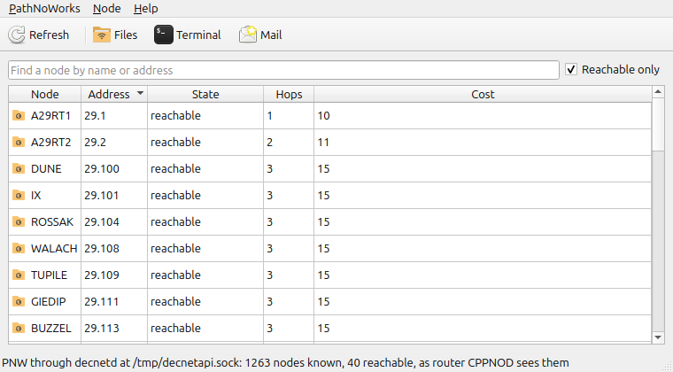
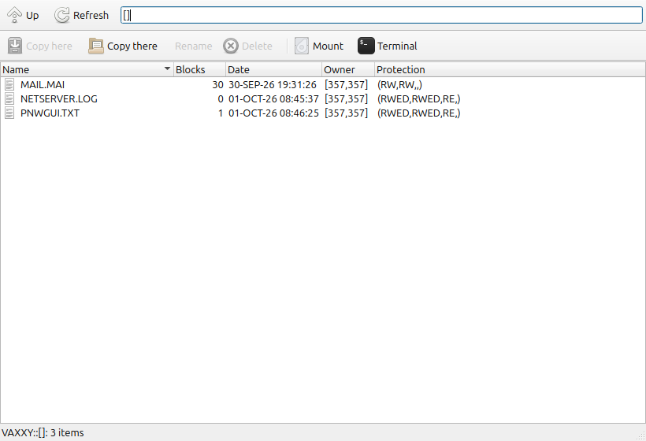
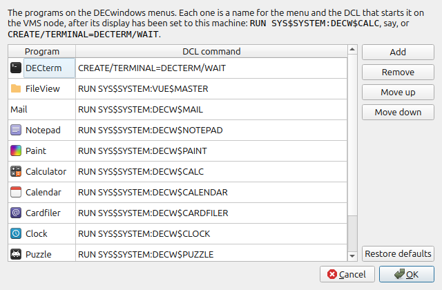
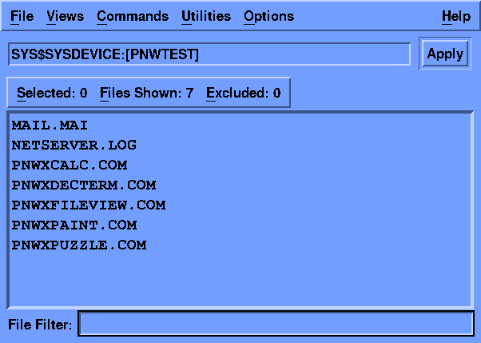
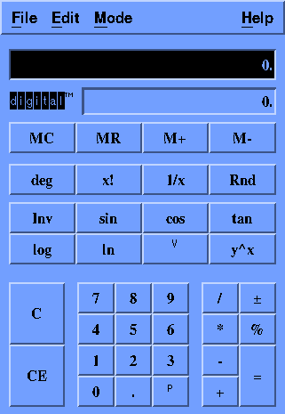
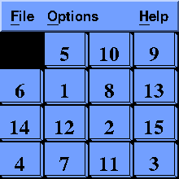
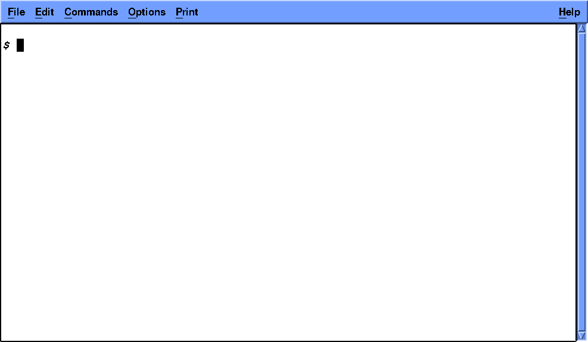
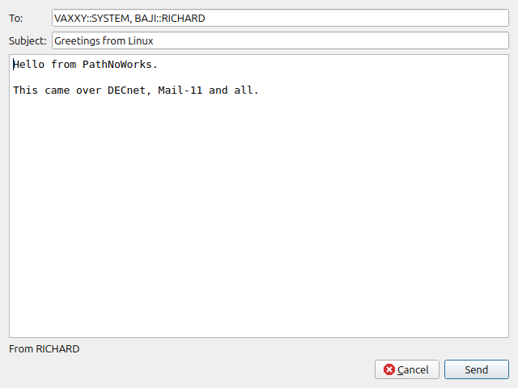

# The PathNoWorks desktop

> *For when you'd rather double-click than type `DIR`.*

`pathnoworks` puts all the command-line tools behind a window. You can
see the DECnet nodes, browse a node's files and copy them in either
direction, log in to a node, and send mail, all with a mouse. That's
about as close to a Pathworks desk as Linux has got.

```sh
pathnoworks                      # the network
pathnoworks --files VAXXY        # straight to VAXXY's files
pathnoworks --socket PATH        # another decnetd, for this run
```

It needs Qt 6 (`qt6-base-dev` to build it), and xterm for terminals. It
gets built with everything else whenever CMake finds Qt 6, and ends up as
`build/gui/pathnoworks`. `cmake --install` also puts it in your desktop
menu.

## The network



The main window lists the nodes decnetd knows, with each node's state,
hops and cost. *Reachable only* hides the rest, and you'll want it:
HECnet has well over a thousand nodes. Type part of a name or address to
find the one you're after.

There's one wrinkle. An endnode only knows that its router is reachable,
which makes for a short and unhelpful list. So on an endnode, PathNoWorks
asks the router instead, just as you'd type
`TELL router SHOW KNOWN NODES`, and says so in the status bar. Any names
the router doesn't know are filled in from this node's own list.

### Favourites

The nodes you actually use get lost among a thousand others, so star
them. Select a node and press **Ctrl+D** (or right-click it, or use
*Node → Favourite*). Favourites:

- get a star, and stay at the top of the list however it's sorted;
- show up even with *Reachable only* ticked, and even if decnetd has
  never heard of them, which is handy for a node that's switched off
  today;
- have their own **Favourites** menu, with Files, Terminal and Mail for
  each, and *Add a node...* for one that isn't in the list at all.

Tick *Favourites only* to see nothing else. They're remembered between
runs.

Double-click a node to see its files. **Terminal** logs in to it, and
**Mail** writes to someone on it. Right-click a node and you get the same
actions. *PathNoWorks → Settings* sets decnetd's API socket; by default
it's `$DECNETAPI`, then `/tmp/decnetapi.sock`.

## Files



A node's files open in a window of their own:

- **Browsing.** Double-click a directory to open it. **Up** goes back,
  and on VMS it keeps going above where you started: `[]` to `[-]`,
  `[A.B]` to `[A]`. You can also type a directory in the path box and
  press Enter: `DUA0:[USER]`, `SYS$LOGIN:`, `[.SUB]`, or `pub/` on a Unix
  FAL.
- **Looking at a file.** Double-click it. Text shows up in a viewer;
  binary files just say so.
- **Copying.** **Copy here** copies the selected files to a local folder.
  **Copy there** copies local files to the directory shown. Text and
  binary are told apart the same way `pnw-copy` does it.
- **Drag and drop.** Drop files from your file manager onto the window
  and they go to the directory shown. Drop them on a directory's row and
  they go into that directory. Drag files *out* of the window, to the
  desktop, a file manager or an editor, and they're fetched first (with
  a progress bar if it takes a moment), then handed over as ordinary
  local files. That also means you can drag from one node's window to
  another's, and the files go node to node by way of your machine.
- **Rename** (F2) and **Delete** (Del) act on the selected files.
- **Mount** mounts the directory shown at `~/DECnet/NODE` with `pnw-fs`,
  read and write, and opens it in your file manager: your network drive,
  one click away. **Unmount** undoes that.
- **Terminal** logs in to the node.

The window starts in your login directory. It works out for itself
whether the node uses VMS names (`[DIR]FILE.TXT;1`) or Unix ones
(`dir/file.txt`), by having a look.

If a node won't talk to you without a login, the window asks for one and
then tries again. Leave the user empty to use the node's default DECnet
account, or tick the proxy box to ask for proxy access under your own
login name. The login lasts as long as the window does.

Everything runs in the background, so the window never freezes while a
slow VAX thinks it over. Each window does one thing at a time, and the
status bar tells you how it went.

## Terminals

**Terminal** opens xterm as a VT340, running `pnw-sethost`. DEC graphics
work, Sixel and ReGIS included, and `SET TERMINAL/INQUIRE` sees a VT340.
There's more in [pnw-sethost](pnw-sethost.md); `Ctrl-]` `q` gets you
out.

On Windows it opens [Windows Terminal](https://aka.ms/terminal) at 80x24
if you have it (it's built into Windows 11; versions from 1.22 show
Sixel), or a console window if not. If the connection fails, the window
stays open to say why until you press Enter.

## DECwindows programs

VMS has a whole desktop's worth of DECwindows programs, and the desktop
can put them on your screen. Select a node in the main window and click
**DECwindows** on the toolbar (it's also on the Node menu, when you
right-click a node, and in a node's file window), then pick one:

| | |
|---|---|
| DECterm | DEC's terminal emulator |
| FileView | the VMS file manager |
| Mail | DECwindows Mail |
| Notepad, Calculator, Calendar, Cardfiler, Clock | the desk accessories |
| Paint, Puzzle, Bookreader | the rest |

That's only where the list starts. **Customize...**, at the bottom of the
menu, lets you add your own programs, take away ones you never use, and
put them in your order. Each is a name for the menu and the DCL that
starts it on the node, once its display points here: `RUN
DUA0:[TOOLS]MYPROG` for one of your own, or a DECterm that runs something
straight away. **Restore defaults** puts the original list back. The list
is kept with the desktop's settings and is the same for every node.



<p>



</p>

The program runs on the VMS node and draws here. Behind the menu, the
desktop:

1. on Windows, starts VcXsrv if no X server is running; see below;
2. starts [`pnw-x11 serve`](pnw-x11.md) if it isn't running, letting that
   node in (if you run one yourself, it uses that, and yours has to let
   the node in);
3. puts a little command procedure, `PNWX<program>.COM`, in your login
   directory on the node: it sets the display to this machine and runs
   the program;
4. connects to it as a DECnet task, which makes VMS run it in a network
   job under your login.

**On Windows** you need an X server, and PathNoWorks uses
[VcXsrv](https://github.com/marchaesen/vcxsrv). Get the installer from
<https://github.com/marchaesen/vcxsrv/releases>, or run
`winget install marha.VcXsrv`. That's the only setup. The desktop starts
VcXsrv itself, with each program in a window of its own, and gives it a
login cookie so only the nodes the bridge lets in can reach your screen.
Details, and how to do it by hand, are in
[pnw-x11](pnw-x11.md#on-windows-vcxsrv).

The file window uses the login it already has; from the main window
you're asked for one, and the dialog remembers the last login for each
node until you quit. The node needs DECwindows installed, and VMS must
be using the real DECwindows transport rather than the stub some
versions leave in place; see [pnw-x11](pnw-x11.md#if-vms-says-cant-open-display)
if every program fails to open its display. The programs close if you
quit the desktop, since their display goes with it.



What works, tried against OpenVMS VAX 6.2 with DECwindows Motif 1.2-3:
DECterm, FileView, the Calculator, the Clock and Puzzle. DECterm gives
you a DCL session of its own in the window; its controller and session
are separate VMS processes, and closing the window ends them.

DEC's fonts aren't on a Linux X server, so programs make do with
substitutes. For much better ones, give DEC's font names to your own
fonts with [`decw-font-aliases.py`](pnw-x11.md#decs-fonts); the desktop
puts them on the X server's font path whenever it starts the bridge
(on Windows, when it starts VcXsrv). A
few characters from DEC's own character sets (the calculator's
square-root key) stay blank either way.

Paint crashes on start: it expects the
8-bit colour displays of its day, not a modern 24-bit one. The
procedures are left in your login directory, ready for next time; delete
them whenever you like.

## Mail



**Mail** writes a message to `NODE::USER`, or several separated by
commas, or `NODE"user password"::USER` for a node that wants a login (see
[pnw-mail](pnw-mail.md)). Each recipient is reported as sent or not, and
the mail goes out under your login name. The window closes once
everything has gone. If something didn't, it stays open and tells you
what failed.

To receive DECnet mail, run `pnw-mail listen`.

## Tested

`ctest` drives the windows offscreen against two decnetd nodes, one
running dnfal. It:

- browses into a subdirectory and back;
- copies a file here;
- copies a text and a binary file there;
- renames, deletes, and views a file;
- tries a missing directory.

The same test can also run against a real VMS node, and it has, against
OpenVMS VAX 6.2:

```sh
QT_QPA_PLATFORM=offscreen PNW_TEST_SOCKET=/tmp/decnetapi.sock \
    PNW_TEST_VMS='VAXXY"user password"' build/tests/test_gui vms_node
```

## What it won't do (yet)

- **Mount puts the login on pnw-fs's command line,** where `ps` shows it
  to other local users for as long as it's mounted. On a shared machine,
  use proxy access or a node's default account instead.
- Files dragged out are fetched whole before the drag starts, so
  dragging a big file takes as long as copying it. The copies are kept in
  a temporary folder until the window closes.
- Copy here, Delete and dragging work on files only, not whole
  directories.
- There are no LAT terminals or MOP in the desktop yet; `pnw-lat` and
  `pnw-mop` are waiting on the command line.
