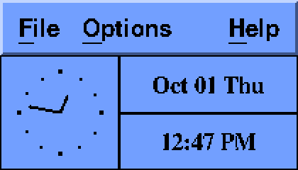

# pnw-x11

> `$ SET DISPLAY/CREATE/NODE=PNW/TRANSPORT=DECNET`
> *and a clock you didn't ask for appears on your Linux desk.*

Pathworks PCs had eXcursion, an X server that let VMS DECwindows programs
open their windows on the PC's screen, over DECnet. X was network
transparent from the start, and DEC made sure DECnet was one of the
networks it could use. pnw-x11 does the same job for Linux: it's a bridge
between DECnet and your ordinary X server.

It works in both directions:

- **`serve`** takes the DECnet object that X clients connect to for a
  display (`X$X0` for display 0), and hands each connection to your local
  X server. A program on VMS then thinks your node *is* a workstation.
- **`connect`** is the other way round. It makes a local display, `:20`
  by default, and sends whatever connects to it on to a DECnet node's X
  server.

```
pnw-x11 [options] serve --allow NODE[,NODE...] [-n display]
pnw-x11 [options] connect NODE[::n] [-d display]
```

```sh
pnw-x11 serve --allow VAXXY &            # VAXXY's programs on this screen
pnw-x11 connect VAXXY -d 20 &            # DISPLAY=:20 means VAXXY::0
```

| Option | Meaning |
|---|---|
| `--allow NODE,...` | (serve) the nodes allowed to open windows, by name or address |
| `--allow-any` | (serve) any node at all; see below before using it |
| `-n n` | (serve) the display to offer, object `X$Xn`; default 0 |
| `--display D` | (serve) the local X server; default `$DISPLAY`. `:0`, or its socket's path |
| `-d n` | (connect) the local display to make; default 20 |
| `--listen PATH` | (connect) the socket to make instead of `/tmp/.X11-unix/Xn` |
| `--socket s` | decnetd's API socket; default `$DECNETAPI`, then `/tmp/decnetapi.sock` |
| `--trace` | log each connection, with byte counts |

## A word about trust

An X client can do almost anything to your desktop. It can read every
key you press, take pictures of the screen and type into other windows.
X has always been like that. So `serve` won't start until you say who may
connect. `--allow VAXXY` lets VAXXY in and turns everyone else away,
logging it:

```
%PNW-W-XREFUSED, NODEB::PNW: not in --allow
```

`--allow-any` exists, and on HECnet it means *anyone on HECnet*. Please
don't.

## The X server's login

Your X server only accepts clients that bring this session's magic
cookie, and a program on VMS has never heard of it. `serve` deals with
that the way SSH's X forwarding does. It reads your cookie from
`$XAUTHORITY` (or `~/.Xauthority`) and swaps it into each connection's
first message, whatever the far end sent. If there's no cookie to be
found, it says so at startup and passes the connection on unchanged.

## From VMS

With DECwindows installed on the VMS side, point a process's display at
your node, then run something:

```
$ SET DISPLAY/CREATE/NODE=PNW/TRANSPORT=DECNET/SERVER=0
$ RUN SYS$SYSTEM:DECW$CLOCK
$ CREATE/TERMINAL=DECTERM/DETACH
```

`PNW` is your node's name as the VMS node knows it. If it doesn't know
it yet, see the end of [pnw-mail](pnw-mail.md) for how to tell it.



That's `DECW$CLOCK` from OpenVMS VAX 6.2, running on a VAX in SIMH and
drawing on a Linux desktop over DECnet.

### If VMS says "can't open display"

If every DECwindows program fails at once with `Can't Open display` (or
`%DECW-E-CANT_OPEN_DISPL`), and pnw-x11 never sees a connection, check
which common transport VMS is using:

```
$ @SYS$UPDATE:DECW$VERSIONS *
```

If it says `DECwindows transport ident is DECWINDOWS V5.4`, you have the
stub VMS installs for systems without DECwindows. Every one of its entry
points returns `%SYSTEM-E-UNSUPPORTED`, so the X library gives up before
it tries the network. On OpenVMS VAX 6.2 the stub (`;2`, from the VMS
saveset) outranks the real one (`;1`, from the DECwindows savesets),
even after DECwindows is installed. Restore the real one as a newer
version, from the VMS CD, and replace the installed copy:

```
$ BACKUP DKA400:[000000]DECW062.C/SAVE/SELECT=[SYS0.SYSLIB]DECW$TRANSPORT_COMMON.EXE;1 -
        SYS$COMMON:[SYSLIB]DECW$TRANSPORT_COMMON.EXE/NEW_VERSION
$ INSTALL REPLACE SYS$SHARE:DECW$TRANSPORT_COMMON.EXE
```

`DECW$VERSIONS` should then show the transport as `DW V6.2-950419`.
It took a debugger trace through the X library to find this one, so I'm
writing it down.

A VAX with no screen of its own needs DECwindows base support (from
`DECW$TAILOR`) and DECwindows Motif. It runs no X server; your Linux
machine is the display.

## Messages

```
%PNW-I-XSERVING, PNW::0 (object X$X0) on :0
%PNW-I-XCONNECT, VAXXY::SYSTEM to :0
%PNW-I-XCLOSED, VAXXY::SYSTEM: link closed by the far end
%PNW-I-XLISTENING, DISPLAY=:20 goes to VAXXY::0
```

## Tested

Against OpenVMS VAX 6.2 with DECwindows Motif 1.2-3, running under SIMH:
`xdpyinfo` from `DECW$UTILS` and `DECW$CLOCK` both opened on a Linux X.Org
server through `pnw-x11 serve`. DEC's fonts are missing on a stock Linux
X server, so the clock warns about its menu font and falls back to
another; it works regardless.

`ctest` runs both halves between two decnetd nodes, with a stand-in X
server. It checks that the cookie is swapped in, that 200 KB survive the
round trip unchanged, and that a node not on the list is turned away.

On a real desktop, both halves chained through one decnetd also ran real
X programs: `connect` made `:20`, and its clients went out over DECnet
and back in to `serve`, on to Xorg. `xdpyinfo`, `xdpyinfo -ext all` and
`xclock` all worked.

## What it won't do (yet)

- Local X servers only, through their Unix socket. No TCP displays.
- `connect` sends no X login to the far server. A DECwindows server that
  insists on one needs its access control opening up for your node.
- One process per display; run two to serve two.
